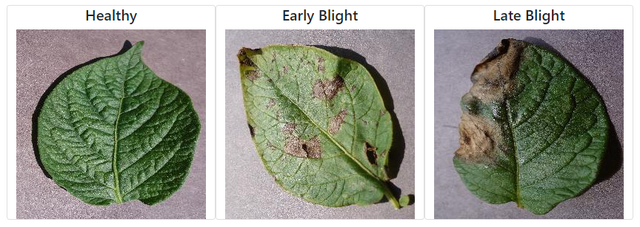
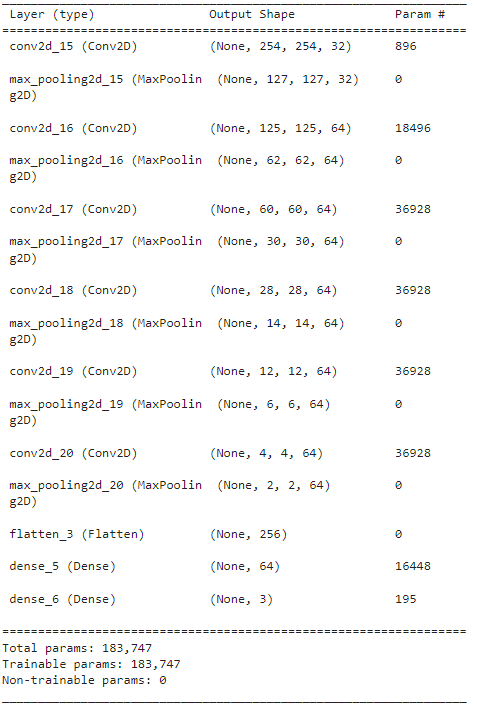

# Potato Disease Classification using CNN

This is a TensorFlow CNN Model for detecting disease in a potato leaf.

## Dataset

The dataset used for this project is obtained from [Kaggle](https://www.kaggle.com/datasets/arjuntejaswi/plant-village)
using the potato folders.

The dataset contains (256 x 256) RGB images of healthy, early blight, and late 
blight leaves

Examples:



The overall samples are 2152, distributed as 1000 late blight, 
1000 early blight, and 152 healthy. Those images were split into 70% 
for training, 20% for validation, and 10% for testing.

## Setup

### Libraries
```
from keras.models import Sequential
from keras.layers import Dense, Activation, Flatten, Conv2D
from keras.layers.convolutional import MaxPooling2D
from keras.preprocessing.image import ImageDataGenerator
import pandas as pd
import numpy as np
```

### Configuration
```
IMAGE_SIZE = 256
CHANNELS = 3
BATCH_SIZE = 32
EPOCHS = 15

train = ImageDataGenerator(rescale = 1./255)
validation = ImageDataGenerator(rescale = 1./255)
```

## Importing Data
```
train_data = train.flow_from_directory(TRAIN_PATH, 
                                       target_size=(IMAGE_SIZE,IMAGE_SIZE), 
                                       batch_size=BATCH_SIZE, 
                                       class_mode="categorical",
                                       seed=2022)

val_data = validation.flow_from_directory(VAL_PATH, 
                                       target_size=(IMAGE_SIZE,IMAGE_SIZE), 
                                       batch_size=BATCH_SIZE, 
                                       class_mode="categorical",
                                       seed=2022)
```

## Model Architecture



## Note
This model was utilized (deployed) in a python Flask App in this [repo](https://github.com/96ibman/FlaskApp-potato-disease-classification)


## Author

- [Ibrahim Nasser](https://github.com/96ibman)


## Links
- [Website](https://96ibman.github.io/ibrahim-nasser/)
- [LinkedIn](https://www.linkedin.com/in/ibrahimnasser96/)
- [Twitter](https://twitter.com/mleng_ibrahim)


